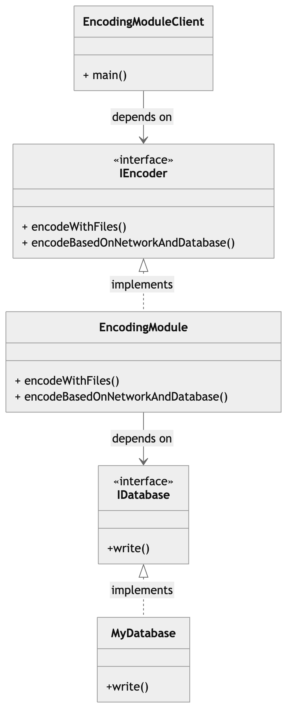

## Problem
This code violates the *Dependency Inversion Principle* since each change in the EncodingModule would impact the EncodingModuleClient and would make it dependent on the low level logic . 

## Solution
As a solution we created an interface which declares the two main methods here, which are the  **encodeWithFiles()** and the **encodeBasedOnNetworkAndDatabase()** methods. 
Additionally, we created an interface which declares the **write()** method of the **MyDataBase**
The final solution consists of : 

- *IEncoder:* an interface declaring the **encodeWithFiles()** and the **encodeBasedOnNetworkAndDatabase()** methods which the **EncodingModule** class will implement.

- *EncodingModule:* a class implementing the **encodeWithFiles()** and the **encodeBasedOnNetworkAndDatabase()** methods.

- *EncodingModuleClient:* a class using the implemented **EncodingModule**'s methods 

- *IDatabase* : an interface declaring the **write()** method

- *MyDatabase* : a class implementing the **write()** method of the **IDatabase**

## Class Diagram

