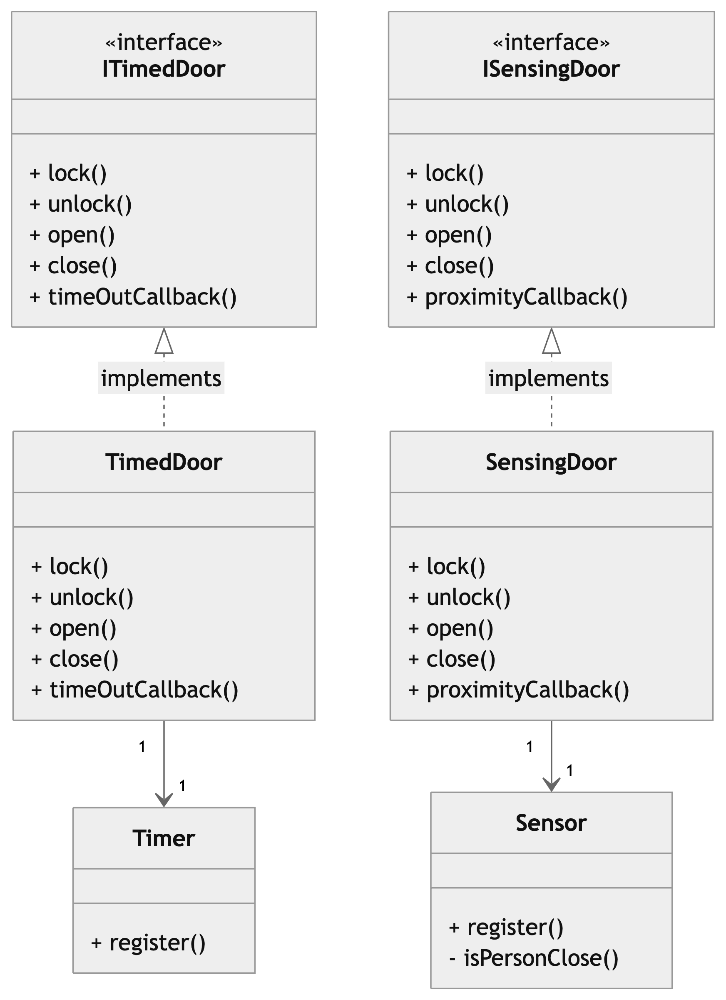

## Problem
This code violates the *Interface Segregation Principle (ISP)* because the **Door** interface requires the implementations of both the timeout-based and proximity-based callbacks (**timeOutCallback()** and **proximityCallback()**). 

However, both the **TimedDoor** and **SensingDoor**, only need one of these methods, resulting in unused and unimplemented methods in each class. 

The Interface Segregation Principle suggests that the classes implementing an interface should not be forced to depend on methods they do not use.

## Solution
As a solution we split the **Door** interface into two smaller more specific interfaces.  
The final solution consists of the following: 

- *ITimedDoor:* an interface declaring the **lock()** and **unlock()**, **open()**, **close()** and **timeOutCallback()** methods, which the **TimedDoor** class will implement.

- *ISensingDoor:* an interface declaring the **lock()** and **unlock()**, **open()**, **close()** and **proximityCallback()** methods, which the **SensingDoor** class will implement.

- *TimedDoor:* a concrete class implementing the **ITimedDoor** interface 

- *SensingDoor:* a concrete class implementing the **ISensingDoor** interface 

- *Timer:* a class containing the **TimeDoor** event management logic

- *Sensor:* a class containing the **SensingDoor** event management logic
 their behaviors .

## Class Diagram
<!--  -->

