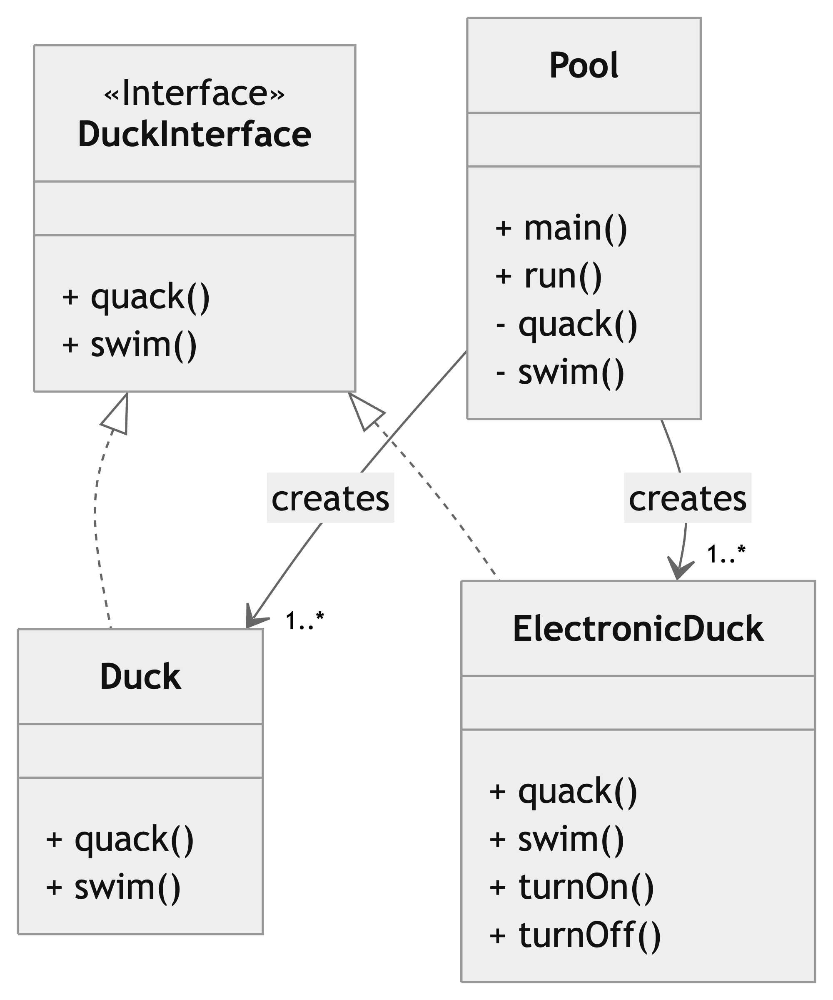

## Problem
In this example, the **ElectronicDuck** class extends from the **Duck** class. 
The **Duck** class, always quack and swims.  
However, the **ElectronicDuck** may not be able to quack or swim without being "turned on".
Such behavior is not required for a Duck object.

Therefore, in the case where a **Duck** object gets a reference of an **ElectronicDuck** object, it could't quack and swim unless it's turned on, meanwhile it is supposed to always quack and swim. 

This goes against the *Liskov Substitution Principle (LSP)*,which states that a subclasses should be substitutable for their base classes without altering the correctness of the program.

## Solution
As a solution we opted for adding an interface and making the following adjustments: 

- *DuckInterface:* an interface declaring the **quack()** and **swim()** methods, which every duck type will implement.

- *Duck:* a concrete class implementing the **quack()** and **swim()** methods 

- *ElectronicDuck:* a concrete class implementing the **quack()** and **swim()** methods, in addition to a **turnOn()** method to enable quacking and swimming as expected.

- *Plot:* a class which instantiates a couple **Duck** and **ElectronicDuck** objects and demonstrate their behaviors .

## Class Diagram

