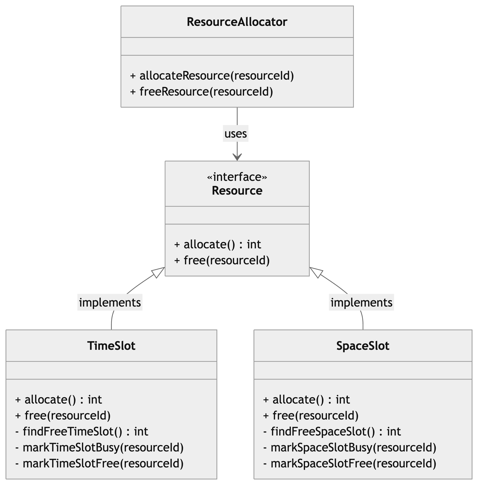

## Problem
In this example, the **ResourceAllocator** class implements the **allocate()** and **free()** methods which rely on a passed argument of a **ResourceType** type.
Therefore, every time a new resource type is added, we would need to modify these methods, thus modifying the **ResourceAllocator** class. 

For example, if we want to add a new resource type (e.g., MEMORY_SLOT), we would need to add more cases in both the allocate and free methods. 
This design is not extensible and violates the **Open/Closed Principle**, since it's not closed for modification 

## Solution
As a solution we opted for diving and refactoring the old source code as follows : 

- Resource: an interface declaring the **allocate()** and **free(resourceId)** methods, which every resource type must implement.

- SpaceSlot: concrete class implementing the **allocate()** and **free(resourceId)** methods of the **Resource** interface , with its own ts own specific allocation and deallocation logic methods (i.e. **findFreeSpaceSlot()** , **markSpaceSlotBusy(int resourceId)**, **markSpaceSlotFree(int resourceId)** )

- TimeSlot: concrete class implementing the **allocate()** and **free(resourceId)** methods of the **Resource** interface , with its own ts own specific allocation and deallocation logic methods (i.e. **findFreeTimeSlot()** , **markTimeSlotBusy(int resourceId)**, **markTimeSlotFree(int resourceId)** )

- ResourceAllocator : responsible for allocating and freeing the resources (the classes implementing the Resource interface)  

## Class Diagram

