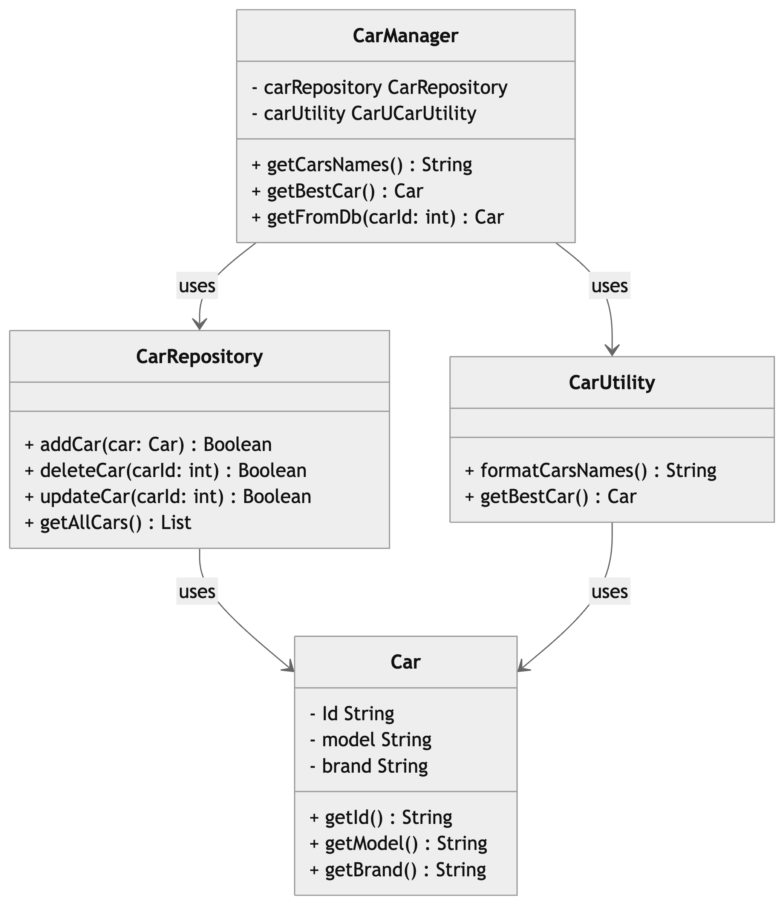

## Problem: 
The existing CarManager class does not respect the rule of Simple Responsibility Principal, as it handles different and unrelated tasks.
In fact , the `getFromDb` and the instantiation of a new list of cars `_cardDb` have nothing to do with the `getCarsNames` and `getBestCar` methods

## Solution 
As a solution we opted for diving and refactoring the old source code as follows : 
- Car :  the Car entity

- CarRepository : responsible for storing the cars and handling basic CRUD (Create, Read, Update, Delete) methods 

- CarUtility: responsible for a couple of the services that the CarManager needs to perform i.e. `getCarsNames` and `getBestCar` methods

- CarManager: responsible for communicating with these two classes in order to perform all desired tasks as the existing code shows i.e. `getCarsNames` , `getBestCar` and `getFromDb` methods

